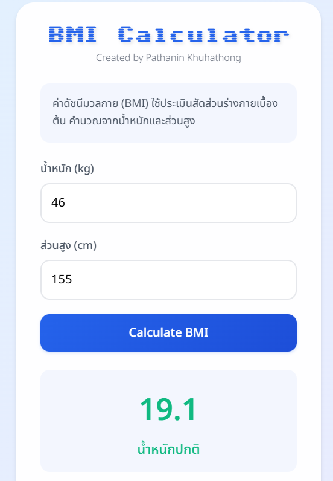

# [BMI Calculator](https://pathanin-kht.github.io/BMI-Calculator-Web/)

## Overviews
A simple and user-friendly **BMI Calculator** web application that helps you calculate your Body Mass Index (BMI) based on weight and height. The application provides real-time results and categorizes your BMI into different health ranges.

## Features
- Calculates BMI based on weight and height.
- Supports both kilograms (kg) and pounds (lb) for weight. (Update 21/1/2568)
- Supports both centimeters (cm) and inches (in) for height.(Update 21/1/2568)
- Categorizes the BMI result into the following ranges:
  - Underweight: BMI < 18.5
  - Normal weight: BMI 18.5 - 24.9
  - Overweight: BMI 25.0 - 29.9
  - Obesity: BMI ≥ 30.0
- Clear Data: Allows you to reset the input and output fields to start fresh.
## How to Use
1. Select your preferred unit for weight (kg or lb).
2. Select your preferred unit for height (cm or in).
3. Enter your weight in the selected unit.
4. Enter your height in the selected unit.
5. Click the "Calculate BMI" button.
6. The result will display your BMI value and its corresponding health category.

## Example
- Weight: `46 kg`
- Height: `155 cm`
- Calculated BMI: `19.1` (Normal weight)
  

## License
This project is licensed under the [MIT License](LICENSE) - see the LICENSE file for details.

## Contact
For feedback or inquiries, feel free to reach out via [pathanin.kht@gmail.com](pathanin.kht@gmail.com).
